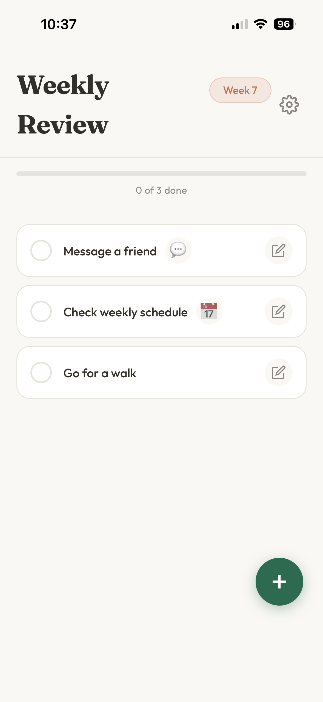
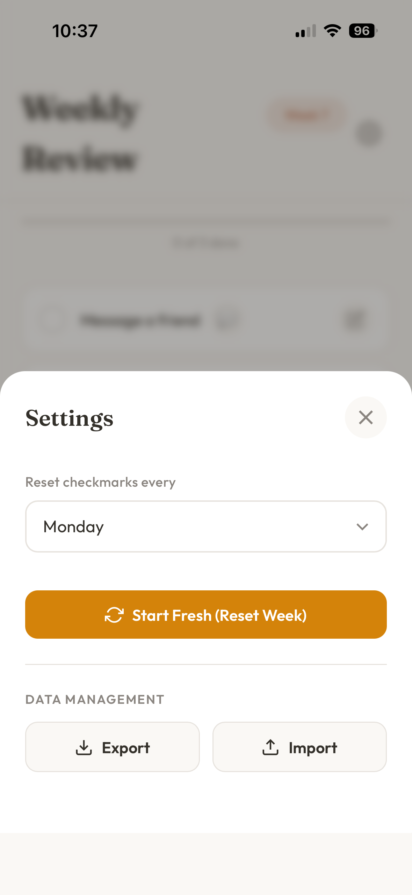

# Weekly To-Do App

> **Goal:** Exploring vibe coding in a non-academic context — building a real, usable app through conversational AI collaboration rather than traditional development.

**Live app:** [tfl600.github.io/weekly-app](https://tfl600.github.io/weekly-app/)

## About

A mobile-first Progressive Web App for weekly to-do tracking. Add recurring tasks, link them to apps (WhatsApp, Calendar, Email, Spotify), and track weekly progress with automatic resets.

## Screenshots

  
  &nbsp;&nbsp;
  
  &nbsp;&nbsp;
  

  <em>Weekly overview with progress tracking &nbsp;&nbsp;&nbsp;&nbsp; Add tasks with deep links to apps &nbsp;&nbsp;&nbsp;&nbsp; Configurable reset day & data backup</em>

## Features

- Add/edit/delete to-do items with drag-and-drop reordering
- Deep links to WhatsApp, Google Calendar, Email, and Spotify
- Weekly auto-reset of checkmarks (configurable day)
- Progress bar with confetti celebration
- Export/import data backup
- Dark mode (follows system preference)
- Offline support via service worker

## Tech Stack

Vanilla HTML, CSS, and JavaScript — no frameworks. Uses localStorage for persistence and a service worker for offline PWA support.
